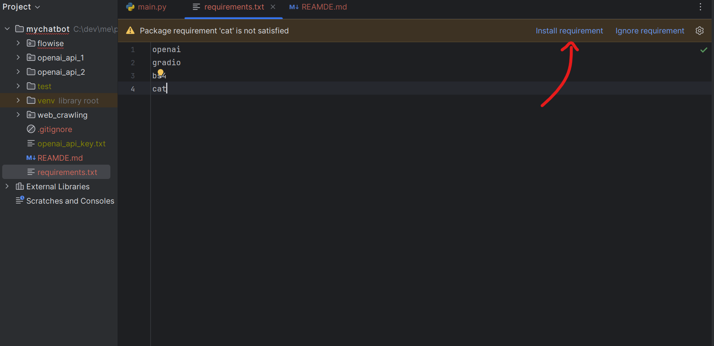

# 평택메타코딩 아카데미 AI코딩반 예제 코드
- 챗봇 웹 크롤링
- flowise로 챗봇 만들기
- openai api로 챗봇 만들기

# 프로젝트 구성 방법
1. [PyCharm](https://www.jetbrains.com/pycharm/download/) 다운로드 후 실행
2. 현재 저장소 zip파일 다운로드 후 압축해제 
3. PyCharm에서 압축해제한 폴더 열기
4. requirements.txt 파일로 들어가서 install requirements 버튼 클릭 (라이브러리 다운)   

5. openai API key를 발급받아서 각 폴더 내에 openai_api_key.txt 파일에 입력
6. 소스코드 실행하기
